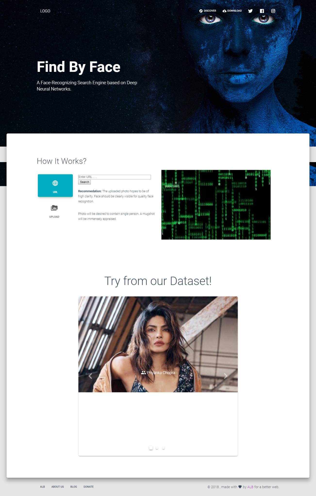

# [Find By Face](https://demos.creative-tim.com/material-kit-react)


   
<!---  -->  
This is the project we started as a three memeber team (ALB) during [MS Hack 2.0](https://mshacks.microsoftlpu.com/) organised at [Lovely Professional University](http://microsoftlpu.com/), Jalandhar, Punjab. We didn't succeeded to win it though, but still this project is in continuous upgradation and soon will be launched under custom domain until then it is available [here](https://findbyface.000webhostapp.com/).

## Table of Contents

* [Demo](https://findbyface.000webhostapp.com/)
* [Frameworks-Used](#frameworks-used)
* [Dependencies](#dependencies)
* [Installation](#installation)
* [File Structure](#file-structure)
* [Contributors](#contributors)
* [Reporting Issues](#reporting-issues)


## Frameworks Used

- [Nodejs](nodejs/node) by Ryan Dahl.
- [Reactjs](facebook/react) by Facebook.
- [Material Kit React](creativetimofficial/material-kit-react) by Creative Tim.


## Dependencies

 - (NVM Recommended) [NodeJs](https://nodejs.org/en/download/) and npm (bundled alongside node)
 - [MiniConda](https://conda.io/miniconda.html)
 - [OpenCV](https://sourceforge.net/projects/opencvlibrary/)
 
```shell
▖~ # run as administrator in Anaconda Prompt
▖~ conda update conda
▖~ conda create -n FindByFace
▖~ activate FindByFace
▖~ conda install python=2 # optioanlly <matplotlib>
▖~ python -m pip install --upgrade pip
▖~ pip install opencv-python # install <numpy>, if not automatically
```


## Installation

- Downloads
```shell
▖~ git clone https://github.com/aniruddha0pandey/FindByFace.git & cd FindByFace
```
- Build
```shell
▖~ npm install
▖~ npm start
```
<sub>Navigate to http://localhost:3000/ if not automatically redirected.</sub>
- Deploy
```shell
▖~ npm install -g serve
▖~ serve -s build
```
<sub>Navigate to http://192.168.209.1:5000/ if not automatically redirected.</sub>


## File Structure
Within the download you'll find the following directories and files:

```
FindByFace/
.
├── CHANGELOG.md
├── LICENSE.md
├── README.md
├── TODO
├── package.json
├── engine/
│   ├── README.md
│   └── 
├── public/
│   ├── index.html
│   └── manifest.json
└── src/
    ├── index.js
    ├── routes/
    │   └── index.jsx
    ├── assets/
    │   ├── img/
    │   │   └── kit/
    │   │       ├── faces
    │   │       └── free/
    │   │           └── examples
    │   ├── jss/
    │   │   ├── material-kit-react/
    │   │   │   ├── components
    │   │   │   └── views/
    │   │   │       ├── componentsSections
    │   │   │       └── landingPageSections
    │   │   └── material-kit-react.jsx
    │   └── scss/
    │       ├── core/
    │       │   ├── mixins
    │       │   └── variables
    │       ├── plugins
    │       └── material-kit-react.scss
    ├── components/
    └── views/
```


## Contributors

<a href="../../../../aniruddha0pandey" target="_blank"></a> <a href="../../../../shubham007kumar" target="_blank"></a> <a href="../../../../yashpathack" target="_blank"></a>

## Reporting Issues

We use GitHub Issues as the official bug tracker. Standard Issue/Bug request is supported.
